Mid-termPractice_NotePad-master

Notepad

一、基础功能

1. 时间戳

   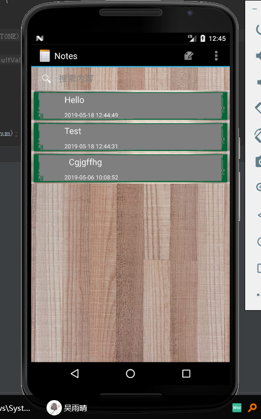

2. 标题搜索框

   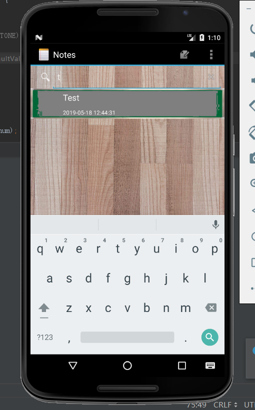

二、拓展功能

1. 修改背景颜色

   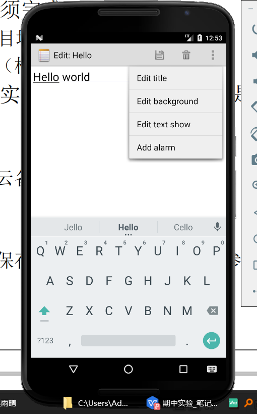

   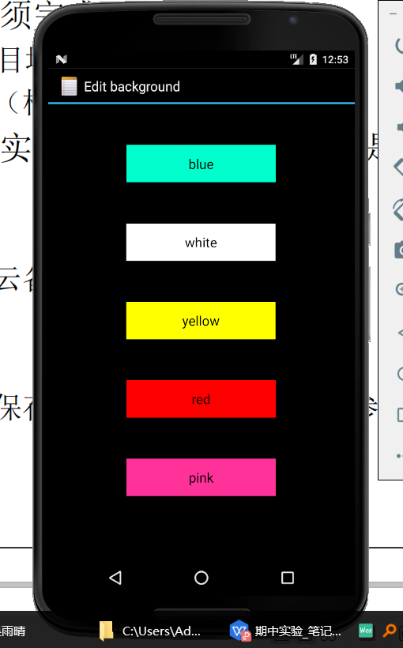

   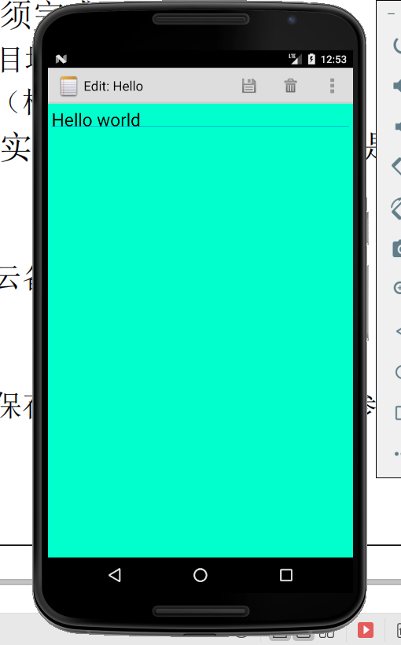

2. 修改字体颜色

   

   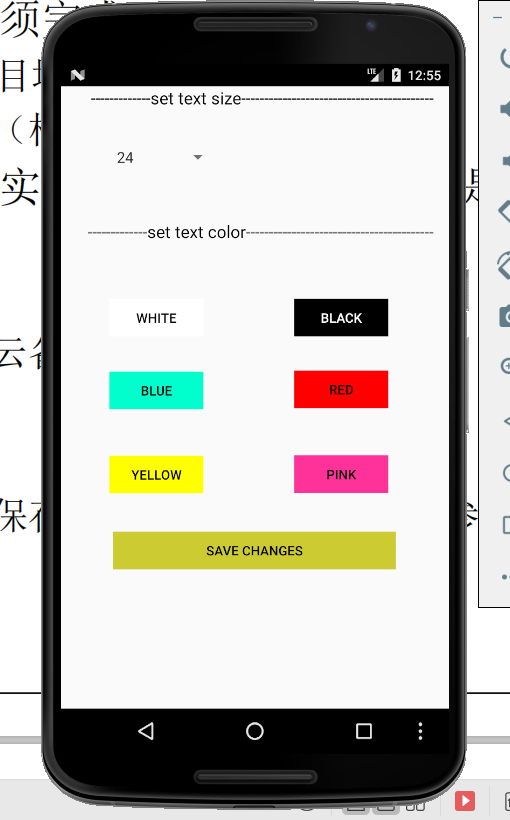

   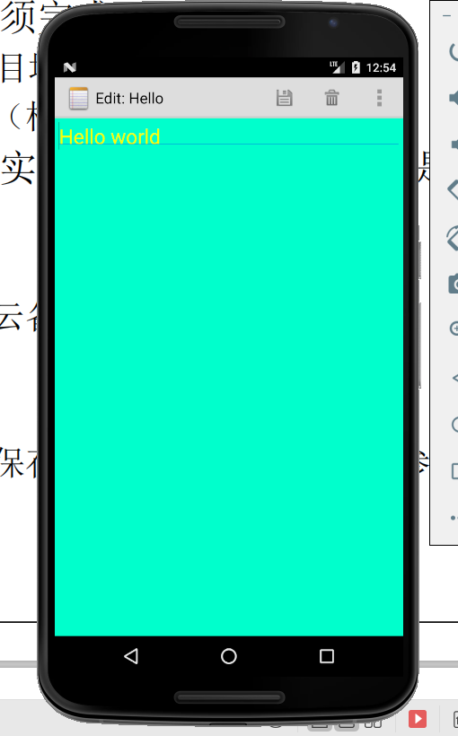

3. 修改字体大小

   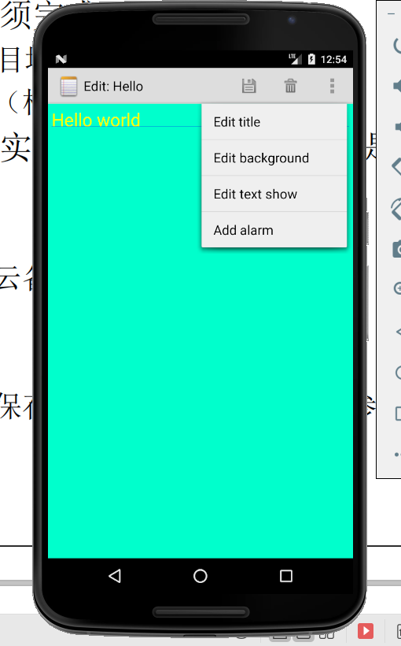

   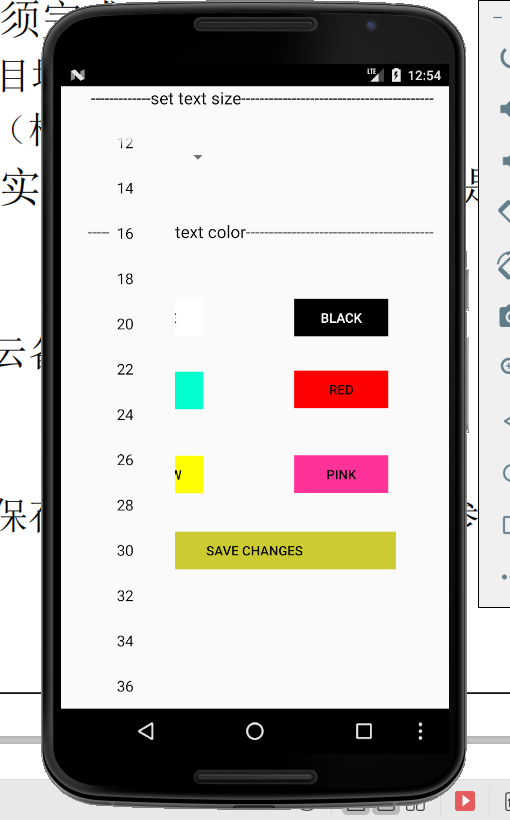

   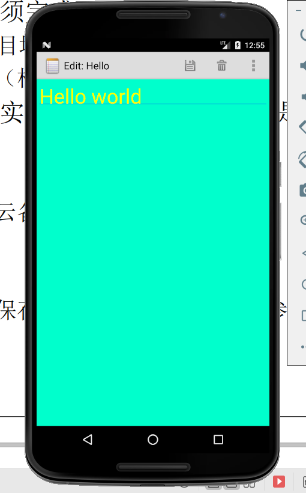

4. 添加闹钟提醒功能

   (还有闹钟声音响起~~~)

   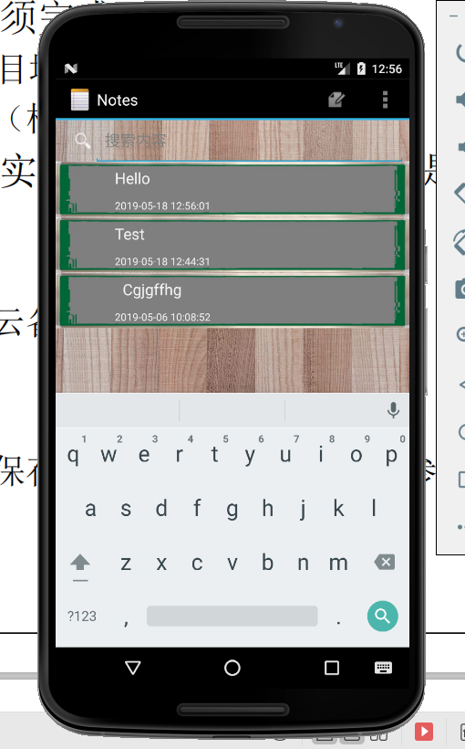

   
   
   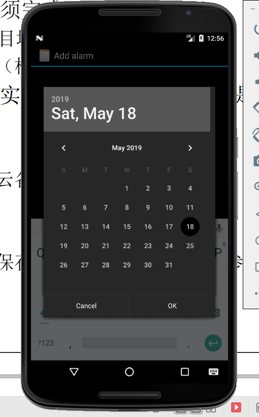
   
   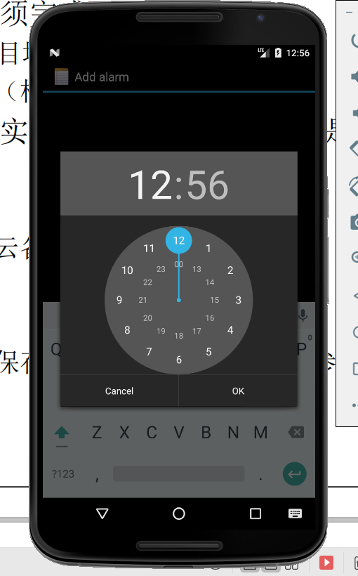
   
   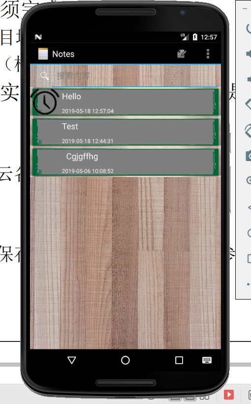
   
   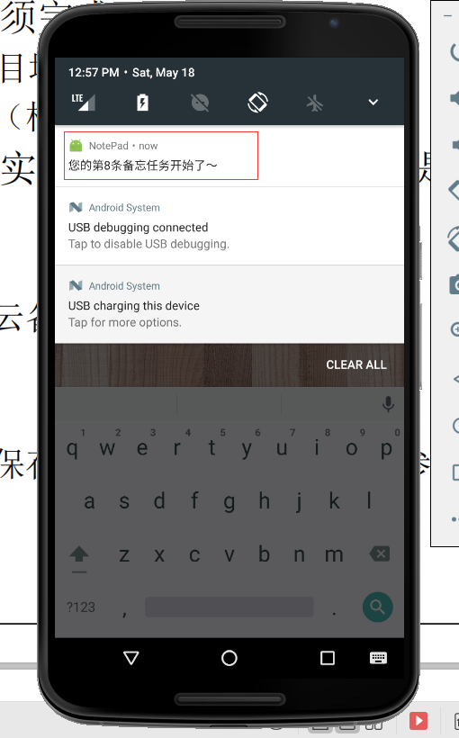